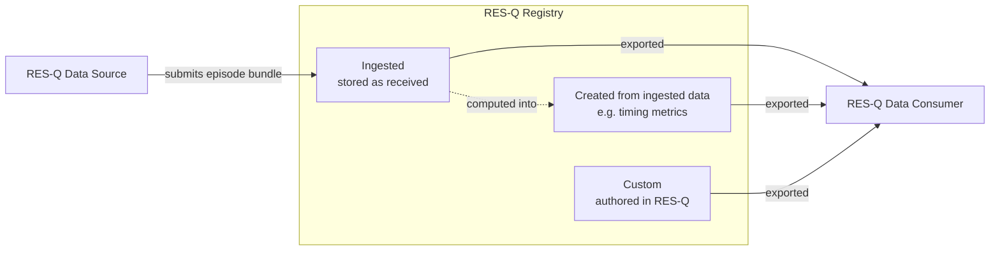

# Data Exchange

The registry stores three kinds of resource, and they do not all travel in the same direction:

| Kind | Where it comes from | Accepted on submission? |
| --- | --- | --- |
| **Ingested resources** | Submitted by a Data Source and stored as received — 46 of the 49 profiles | **Yes** |
| **Resources created from ingested data** | Computed by the registry out of what it has already ingested — the [timing metrics](StructureDefinition-timing-metric-observation-profile.html) | No — the registry produces them |
| **Custom resources** | Authored and maintained inside RES-Q itself, independent of any one episode — the [questionnaire definitions](StructureDefinition-patient-reported-outcome-questionnaires.html) | No — the registry owns them |

Only the first kind is accepted on submission. The other two the registry produces itself and offers outward: they can be **exported, but not added**. Every profile in this guide says which of the three it is, in computable form, and that is what this page explains.

The statement lives on the profile, not in the data. A `TimingMetricObservation` instance on the wire looks the same whether the registry ingested it or created it; what differs is what this guide obliges each participant to do with it.

## Actors

Three [ActorDefinition](artifacts.html) resources name the participants. They are **roles, not deployments**: a hospital system may play both the Data Source and the Data Consumer role.

| Actor | Role |
| --- | --- |
| [RES-Q Data Source](ActorDefinition-resq-data-source.html) | Hospital information system, EHR or transformation pipeline that produces a stroke episode and submits it |
| [RES-Q Registry](ActorDefinition-resq-registry.html) | Ingests and stores submitted data, creates further resources from it, holds its own custom resources, and offers all three onward |
| [RES-Q Data Consumer](ActorDefinition-resq-data-consumer.html) | Research, analytics, benchmarking or clinical system that queries the registry |

The registry has to be named as an actor in its own right. Without it, "produces" and "processes" could not be attached to anyone in particular: the registry is a consumer when a hospital submits and a source when someone queries, so a two-actor model of Source and Consumer alone would either say nothing about the registry, or collapse both cases into the same statement.

**The canonical URL of an actor is an identifier, not a service address.** Nothing is listening at `http://qualityregistry.org/ActorDefinition/resq-registry`; it names a role the way a profile URL names a shape. Real service addresses, when published, belong in an `Endpoint` resource or in `CapabilityStatement.implementation`, neither of which this guide defines.

Only the ingested box has an arrow coming in. That asymmetry is the whole point: everything the registry holds can go out, but only one of the three kinds can come in.

## Reading the obligation tables

Each profile page renders an **Obligations** view with one row per actor. This guide uses exactly two codes from the HL7 [obligation code system](http://hl7.org/fhir/CodeSystem/obligation):

| Code | Meaning |
| --- | --- |
| `SHALL:able-to-populate` | This actor **produces** instances of the profile |
| `SHALL:handle` | This actor must **correctly process** instances it receives |

Direction therefore reads straight off the table — who can produce it, and who must cope with it:

**An ingested resource** has three rows — a Data Source produces it, the registry takes it in and offers it back out:

| Actor | Obligation |
| --- | --- |
| RES-Q Data Source | `SHALL:able-to-populate` |
| RES-Q Registry | `SHALL:handle` **and** `SHALL:able-to-populate` |
| RES-Q Data Consumer | `SHALL:handle` |

**A resource created from ingested data** has two, and the registry has lost `SHALL:handle` — it never receives this profile, it computes it:

| Actor | Obligation |
| --- | --- |
| RES-Q Registry | `SHALL:able-to-populate` |
| RES-Q Data Consumer | `SHALL:handle` |

**A custom resource** also has two, but the registry keeps `SHALL:handle`, because it does manage instances of this profile internally — it just does not accept them from anyone else:

| Actor | Obligation |
| --- | --- |
| RES-Q Registry | `SHALL:handle` **and** `SHALL:able-to-populate` |
| RES-Q Data Consumer | `SHALL:handle` |

In both export-only cases the Data Source row is **absent**, and that absence is the statement: nobody submits this profile. The positive, machine-readable form of it is the [submission capability statement](CapabilityStatement-resq-registry-submission-capabilities.html), which does not list the profile.

## Which profile is which kind

**46 of the 49 profiles are ingested resources**, submitted by a Data Source. The exceptions are below. ([Base Stroke Observation](StructureDefinition-base-stroke-observation.html) is the forty-ninth; see the last section.)

### Resources created from ingested data

Computed by the registry out of data it has already ingested. Export only.

| Profile | Computed from | Why not submitted |
| --- | --- | --- |
| [Timing Metric Observation](StructureDefinition-timing-metric-observation-profile.html) | Timestamps already carried on [Stroke Encounter](StructureDefinition-stroke-encounter-profile.html), the [Procedure profiles](profiles.html#procedures) and the [MedicationAdministration profiles](profiles.html#medications) | Door-to-needle, onset-to-door, door-to-groin and the related process metrics are arithmetic over data the registry already holds. Computing them centrally keeps every contributing hospital on the same definition, which is the point of a quality registry. A submitted value would compete with the registry's own derivation. |

An instance of this profile arriving inside a submission bundle is discarded, not stored, and not treated as an error — the registry's own computed value stands.

### Custom resources

Authored and maintained inside RES-Q itself, rather than derived from any episode. Export only.

| Profile | Why not submitted |
| --- | --- |
| [Patient Reported Outcome Questionnaires](StructureDefinition-patient-reported-outcome-questionnaires.html) | The questionnaire definitions are maintained by RES-Q, not by a contributing hospital. A Data Source answers them — submitting a [QuestionnaireResponse](StructureDefinition-patient-reported-outcome-questionnaire-responses.html), which *is* accepted — but it does not author the instruments. Because no `Questionnaire` profile is accepted, the `Questionnaire` resource type does not appear in the submission capability statement at all. |

### Profiles that are never instantiated directly

[Base Stroke Observation](StructureDefinition-base-stroke-observation.html) is a parent profile that supplies shared subject, encounter, status and code constraints to the other Observation profiles. It carries no obligations and appears in no capability statement; instances always conform to one of its children.

## Capability statements

Four CapabilityStatements describe the API level, and this is where the split becomes machine-readable for a tool. A single statement could not express it: `Observation` allows only one `rest.resource` entry, yet it carries both ingested resources (vital signs, scores, labs) and created ones (timing metrics). Writing one statement per direction solves that, because each gets its own `supportedProfile` list.

| Capability statement | Interactions | Profiles listed |
| --- | --- | --- |
| [Registry — submission](CapabilityStatement-resq-registry-submission-capabilities.html) | `create`, `update`, plus `transaction` and `batch` | 46 across 16 resource types — no `Questionnaire` entry, and the `Observation` entry omits `timing-metric-observation-profile` |
| [Registry — query](CapabilityStatement-resq-registry-query-capabilities.html) | `read`, `vread`, `search-type`, `history-instance` | 48 across 17 resource types — timing metrics and questionnaires included |
| [Data Source](CapabilityStatement-resq-data-source-capabilities.html) | `create`, `update`, `transaction` (client) | 46 |
| [Data Consumer](CapabilityStatement-resq-data-consumer-capabilities.html) | `read`, `search-type` (client) | 48 |

The registry has two of them because one cannot do the job: a CapabilityStatement allows only a single `rest.resource` entry per resource type, and `Observation` is both ingested and created. `ActorDefinition.capabilities` is `0..1`, so the [RES-Q Registry](ActorDefinition-resq-registry.html) actor formally links to the submission statement — the constraining one — and the query statement is reached from here and from the actor's own page.

These are `kind = requirements` statements: they describe the capabilities each role must have, not a running server. They carry no base URL for the same reason the actors carry none.

The two absences from the submission statement are deliberate and match the absent Data Source rows in the corresponding obligation tables. A validator or a client generator can act on either representation.

## Adding a derived profile later

The direction of a profile is set by a single ruleset insert in its `.fsh` source, defined in `_profiles_common.fsh`:

- `* insert RESQSubmittedProfile` — **ingested**: the registry accepts and stores it
- `* insert RESQRegistryDerivedProfile` — **created from ingested data**: the registry computes it and discards submissions
- `* insert RESQRegistryAuthoredProfile` — **custom**: the registry authors it; exportable, not addable

Swapping the insert and regenerating updates the profile's obligation table; the capability statements are generated from the same classification, so they stay consistent.
